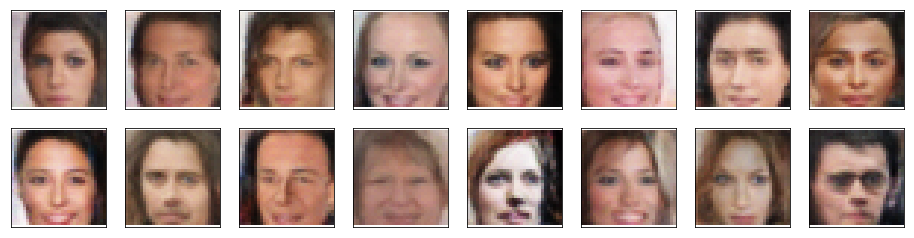
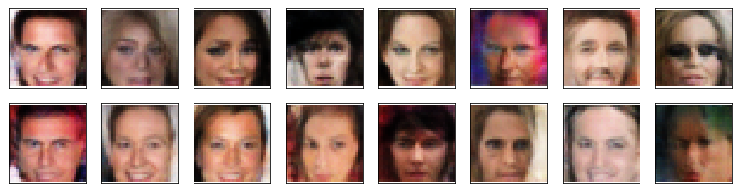
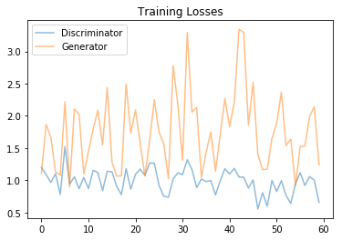
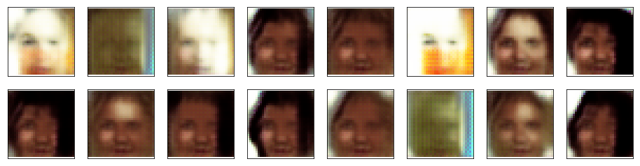
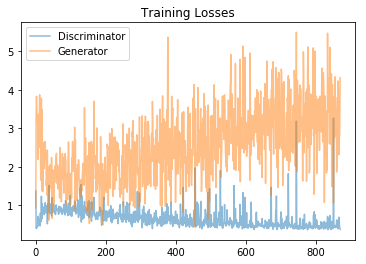

## Deep Convolutional Generative Adversarial Network (DCGAN)

Welcome, I built this notebook while studying the AI nanodegree at Udacity. A Deep Convolutional Generative Adversarial Network (DCGAN) is built and trained using the [celebrity face attributes dataset](http://mmlab.ie.cuhk.edu.hk/projects/CelebA.html). The heuristic trains two neural networks concurrently, a generator and a discriminator. The generator aim is to learn how to create new photos with similar statistical distribution as the training set, while the discriminator job is to learn to differentiate between real and fake photos. Early in the learning process, the generator is forced to change its learning strategy since the discriminator continuously detects fake photos. Progressively, the generator learns to produce higher quality photos that ultimately pass as real. Thus, fooling the discriminator. In the context of neural networks, such learning principle was applied by Ian Goodfellow et. al in 2014 as a framework for estimating generative models via adversarial networks. See paper [generative adversarial nets]( https://papers.nips.cc/paper/5423-generative-adversarial-nets.pdf).

DCGANs have a much broader scope of application than producing fake photos, such as: improving the quality of existing classifiers, by training them on new synthetic datasets; the creation of content generative models for audio and image (and perhaps other classes of data). I’m sure new application domains will continue to emerge.  

Returning to the problem at hand. Both the generator and discriminator were trained on small size images, 64x64x3 RGB. However, if the model is improperly design, training can it can be can be painstakingly time-consuming and difficult. It is always wise to learn both from mistakes and success, thus I also report some of failed network and hyper-parameter configurations. Table I summarizes the architecture of the successful network. See their configuration setup in the jupyter notebook. 

 Table I. DCGAN architecture .
 

|Layer | Generator | Discriminator |
|:-------|:---------------|:---------------|
|1|Linear |Conv2d->BatchNorm2d | 
|2| Dropout | Conv2d->BatchNorm2d |
|3| ConvTranspose2d -> BatchNorm2d | Conv2d->BatchNorm2d |
|4| ConvTranspose2d -> BatchNorm2d | Linear|
|5| ConvTranspose2d -> BatchNorm2d | Dropout|

The network architecture is useless without proper hyper-parameter tuning. Hyper-parameter tuning sometimes fields like a dark art because, to my knowledge, there is no analytical approach to find an optimal configuration analytically. Thus, very often, the experimenter has to turn to best practices know to date. To be honest, I spent a lot of time on training the network. The reviewer comments really helped a lot and probably saved me a significant amount of time and frustration scavenging research papers for hints on what to do. Among the most important observations on tuning I learned the following:

- Leaky ReLU alleviates the problem of sparse gradients. 
- Custom weight initialization accelerates the learning process. 
- Dropout helped balanced dominance between the generator and discriminator. 

The hyper-parameters that produced the best results are summarized in Table II.

 Table II. DCGAN hyper-parameters.
 

|Layer | Generator | Discriminator |
|:-------|:---------------|:---------------|
|Dropout| 0.5 | 0.5 |
|Convolution dimension| 32 | 32 |
|Linear layer size| 100 | 100 |
|Betas| (0.1, 0.999) | (0.1, 0.999) |
|Learning rate | 0.0003 | 0.0003 |
|Number of epochs |  30 |  30 |

Other parameter include: batch size of 64; the network was tested with 10, 20, and 30 epochs. The quality of the resulting images did not degradate significantly as the number of epochs increased. The following figures shows the resulting images using 10 and 30 epochs.

 Fig. 1. DCGAN generator photos using 30 epochs.
 

 Fig. 2. DCGAN generator photos using 10 epochs.
 

The discriminator and generator learning error for the 30-epoch experiment is illustrated in the following figure.

 Fig. 3. Generator and discriminator error using 30 epochs.
 

The error values were produce each 100 iterations, this explains why there are so few data points in Fig. 3. Both the generator and discriminator find a compromise in early training and maintain it during later epochs. This behavior did not occur until dropout and weight initialization were included.   

## Previous results

The intent of this section is to learn from my mistakes. My initial network architecture included one more ConvTranspose2d -> BatchNorm2d in both the generator and discriminator. Instance normalization was used instead of batch normalization. Dropout was not used. Tested hiper-parameters include: beta (0.1, 0.999), learning rate of 0.01, 0.001, and 0.002, discriminator and generator convolution dimensions 64, linear layer size of 120, and batch sizes of 16, 20, 32, and 64 were tested. Results were bad. I do not post all experiment results. Only the following example:

 Fig. 4. DCGAN generator photos using 30 epochs, batch size 32, beta1 0f 0.2 and learning rate of 0.003.
 

 Fig. 5. Generator and discriminator error using 30 epochs.
 

Error values were printed every 50 points. 

All the code was built with [Pytorch]( https://pytorch.org/). Models were trained using a GPU equipped architecture. Amazon web services provide EC2 GPU instances, for a cost.   

I want to express my appreciation to:
-	Yiwen(Owen) H (my mentor)
-	And to the Udacity community of reviewers.

