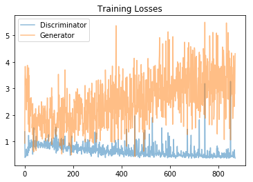
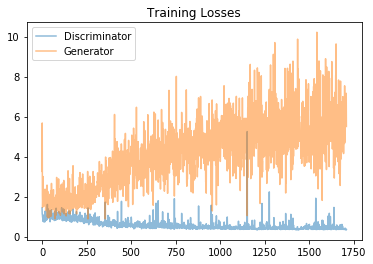

## TV script generation using RNN

Welcome, I built this notebook while studying the AI nanodegree from Udacity. This notebook addresses an unsupervised learning problem in which a Deep Convolutional Generative Adversarial Network (DCGAN) is train on the [CelebFaces Attributes Dataset (CelebA)](http://mmlab.ie.cuhk.edu.hk/projects/CelebA.html). Images sizes are 64x64x3 RGB. A DCGAN architecture composed by a Generator and Discriminator is presented. The Generator is composed by four convolutional layers and a single linear layer, while the Discriminator is composed by a linear layer and four trasposed convolutional layers. Batch normalization is both the Generator and Discriminator. I chose a small learning rate and 30 iterations in order to give the network more time to extract detailed features from the dataset. Some of the generated faces are incorrect, this may occur when the features corresponding to objects are included in the model (i.e. sun glasses). Images with such objects should be excluded from the learning process. The dataset images are small and low resolution, thus it makes the learning process complex. See Fig. 1 for experiment 1 learning error.

New experiments were performed as requested. The batch size was increased to 32, instance normalization was used, the beta1 parameter was set to 0.2 and the learning rate was set to 0.003. The quality of the generated faces degradated. Some dark spots appear in eye regions. See Fig. 2 for experiment 2 learning error.

All the code was built with [Pytorch]( https://pytorch.org/). Models were trained using a GPU equipped architecture. Amazon web services provide EC2 GPU instances, for a cost.   

I want to express my appreciation to:
-	Yiwen(Owen) H (my mentor)
-	And to the Udacity community of reviewers.

